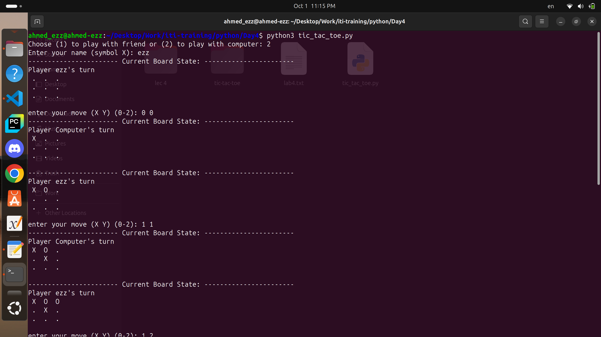

# Tic-Tac-Toe (Python)

A simple command-line Tic-Tac-Toe game implemented in Python using **Object-Oriented Programming (OOP)** principles.  
The game supports two modes:

- **Player vs Player**
- **Player vs Computer (Computer makes the first available move)**

---

## Features

- OOP design with classes: `Player`, `HumanPlayer`, `ComputerPlayer`, `Board`, and `Game`.
- Input validation for moves (prevents invalid positions).
- Board display updates after every move.
- Automatic win/draw detection.
- Computer player with a simple move strategy (chooses the first available cell).


## How to Run

1. Clone or download this script.

```bash
python3 tic_tac_toe.py
```


## Gameplay

- Choose the game mode:

  - 1 → Play with a friend.

  - 2 → Play against the computer.

- Enter player names.

- Players take turns placing their symbols (X or O) on the 3x3 board.

- The game ends when:

  - One player completes a row, column, or diagonal (win).

  - The board is full with no winners (draw).


## Screenshots of both modes

### human vs. human


### human vs. computer


